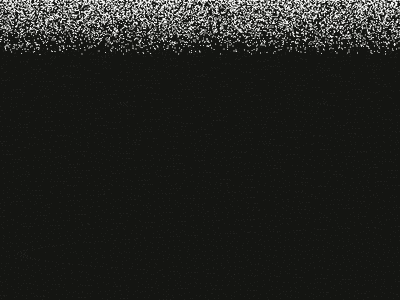

# Let it Slow

Slow and purposely unefficient rendering of the 100000 snowflakes written in an object oriented way.



Purpose of this project is to measure cache misses and branches and results compare with a efficient solution written in data oriented way (TBD).

## Cache Misses and Branches

Used [Cachegrind](https://valgrind.org/docs/manual/cg-manual.html) for cache and branch prediction profiling.

### vector (const size)

```
I   refs:      31,490,328,855
I1  misses:         3,077,683
LLi misses:           611,233
I1  miss rate:           0.01%
LLi miss rate:           0.00%

D   refs:      16,290,018,807  (11,181,945,447 rd   + 5,108,073,360 wr)
D1  misses:        72,463,124  (    55,792,809 rd   +    16,670,315 wr)
LLd misses:        44,296,103  (    28,651,670 rd   +    15,644,433 wr)
D1  miss rate:            0.4% (           0.5%     +           0.3%  )
LLd miss rate:            0.3% (           0.3%     +           0.3%  )

LL refs:           75,540,807  (    58,870,492 rd   +    16,670,315 wr)
LL misses:         44,907,336  (    29,262,903 rd   +    15,644,433 wr)
LL miss rate:             0.1% (           0.1%     +           0.3%  )

Branches:       4,517,766,155  ( 3,947,218,509 cond +   570,547,646 ind)
Mispredicts:       35,174,201  (    34,788,602 cond +       385,599 ind)
Mispred rate:             0.8% (           0.9%     +           0.1%   )
```

### vector (volatile size)

TBD

### list

TBD

## Assembly output

### vector (const size)

TBD

### vector (volatile size)

TBD

## Summary
